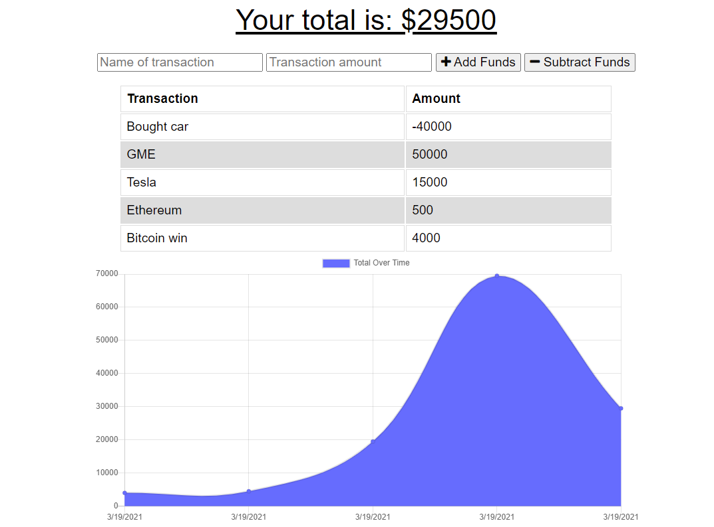

# Budget-tracker2000

## Description

Can I afford another coffee? Probably! Time to check the budget tracker 2000! Enter a name, a value, and selected whether it's an expense or deposit!

Deployed app: 

## Contributing

There are many ways in which you can participate in the project, for example: 
* Submit bugs and feature requests to the email below, and help us verify as they are checked in 
* Review source code changes
* Review the documentation and make pull requests for anything from typos to new content

## Questions

For any additional questions see my [GitHub profile](http://github.com/tylerpetri) or contact tylerpetri@hotmail.com